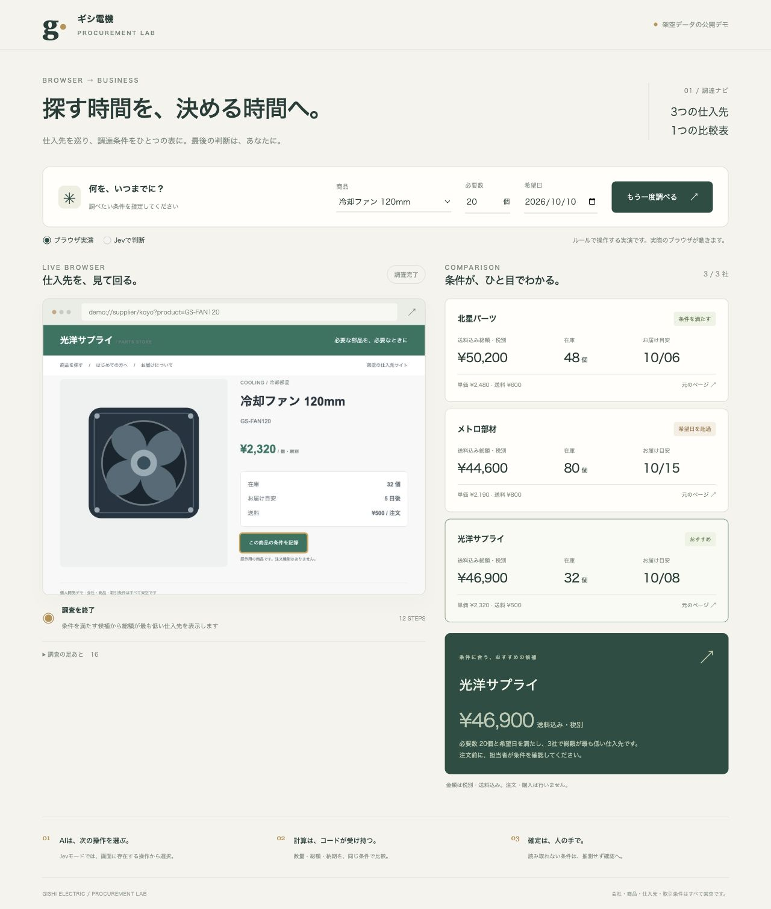

# 調達ナビ

**仕入先を巡り、在庫・価格・納期をひとつの比較表へ。**

架空の家電メーカー「ギシ電機」の調達担当向けに作った、個人開発のデモです。
型番・必要数・希望日を指定すると、実際のブラウザが架空の仕入先3社を開き、
検索と商品詳細の確認を進めます。ブラウザ画面と比較結果を並べて見られます。

会社・人物・商品・仕入先・取引条件はすべて架空です。実運用・納品の実績ではありません。
購入・注文・メール送信の機能はありません。



## 試せること

- 冷却ファン・温度センサーの型番検索と、在庫・単価・納期・送料の収集
- 送料を含む税別総額と到着目安の比較
- 在庫不足・希望日超過の区別と、条件に合う最安候補の表示
- 元の商品ページと操作履歴の確認、調査途中の停止

初期条件は冷却ファン20個・7日後まで。最安の単価を持つ仕入先は納期に間に合わず、
条件を満たす仕入先の中から候補を示す例になっています。
必要数を100個にすると、すべての仕入先が在庫不足になる例を試せます。

## AIとコード、人の分担

| 担当 | 役割 |
|---|---|
| Jev | 現在の画面に存在する候補から、入力・検索・詳細表示・条件収集の次の操作を選ぶ |
| コード | 入力する型番を保持し、操作対象を限定する。表示された条件を取得し、数量・総額・日付を比較する |
| 人 | 元ページと比較結果を確認し、発注先を決める |

Jevモードでは自由な操作コードを生成させません。観測できた操作だけを選択肢として渡し、
受け取った選択肢を確認して実行します。ブラウザのアクセス先はこのデモの仕入先ページに限定します。
同時に複数の調査を開始できないようにし、API障害を実演モードへの自動切り替えで隠しません。
1社あたりの操作回数には上限があります。条件を取得できなかった仕入先は未確認として残します。

### 2つの実行モード

- **ブラウザ実演**：APIキー不要。次の操作は固定ルールで決め、実際のChromiumで検索・確認します。
  Jevの性能を示すものではありません。
- **Jevで判断**：TypeSafe APIに架空の型番とページ本文を送り、Jevが次の操作を選びます。
  APIキーと利用料金が必要です。文字・判断用のモデルであり、画像は送信しません。

日本語での操作精度・処理時間・料金は、実際のJevで確認してから判断する必要があります。
現在の実演モードの結果を、Jevの精度や速度として扱わないでください。

## 起動

Python 3.13以上を使用します。

```sh
python3 -m venv .venv
source .venv/bin/activate
pip install .
playwright install chromium
uvicorn app:app --host 127.0.0.1 --port 8871
```

ブラウザで `http://127.0.0.1:8871` を開きます。
Jevを使う場合は、起動前に `TYPESAFE_API_KEY` を環境変数へ設定してください。
キーをソース・画面・履歴へ書き込まないでください。`.env` は自動では読み込みません。
既定のモデルは `jev-1.13.0` です。`JEV_MODEL` で変更できます。
ポートを変える場合は、`PORT` 環境変数と起動時の `--port` を一致させます。

## デモの範囲

実際の仕入先サイト、ログイン、支払い、注文、サイトごとの利用規約への対応は含みません。
実演用サイトはこのアプリ内にあります。取得条件はサンプルで、納期は調査日からの目安です。
結果はメモリ内に保持し、サーバー再起動で消えます。ローカルでの単一利用を想定しています。

## 謝辞・使っているOSS

- [jev-browser](https://github.com/jkudish/jev-browser)（MIT）：観測した画面の操作候補をJevに選ばせる構成を参考にしました。ソースのコピーではなく、このデモ向けの小さな実装です。
- [Playwright](https://github.com/microsoft/playwright)（Apache-2.0）：ブラウザ操作と画面取得。
- [FastAPI](https://github.com/fastapi/fastapi)（MIT）、[Uvicorn](https://github.com/encode/uvicorn)（BSD-3-Clause）：ローカル画面とAPI。
- [HTTPX](https://github.com/encode/httpx)（BSD-3-Clause）、[Pydantic](https://github.com/pydantic/pydantic)（MIT）：API接続と入力の検査。
- [TypeSafe AI](https://docs.typesafe.ai/)：Jevの有料ホステッドAPI。Jevモデル自体をこのリポジトリで配布しません。

画面デザイン、仕入先サイト、サンプル商品データ、部品イラストはこのデモ用に作成しました。
本リポジトリのコードはMITライセンスです。
